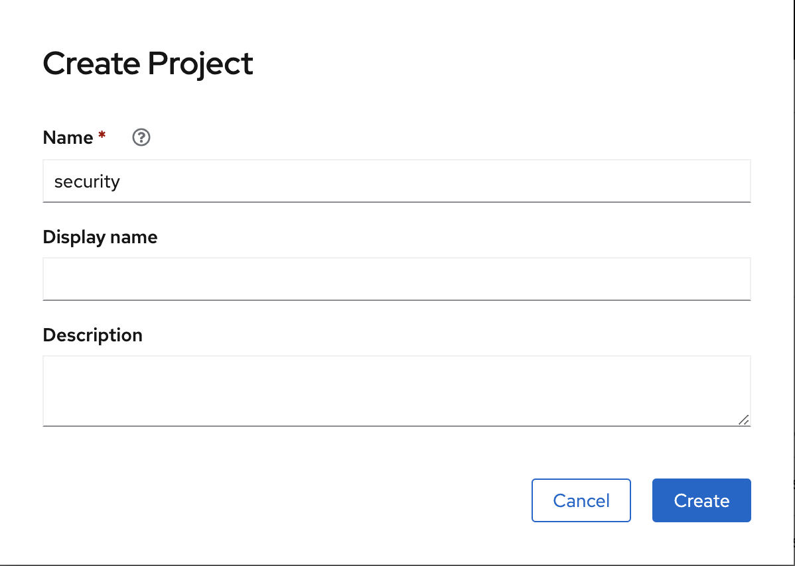
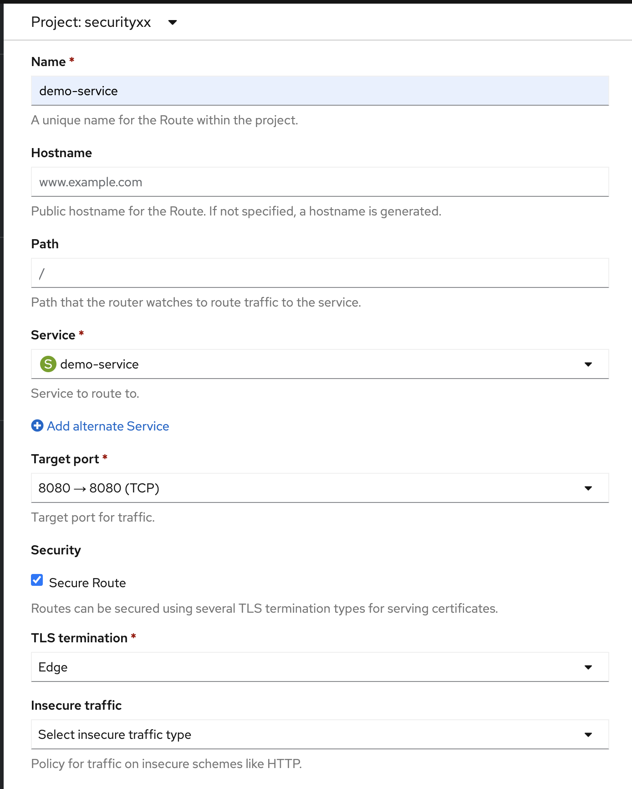
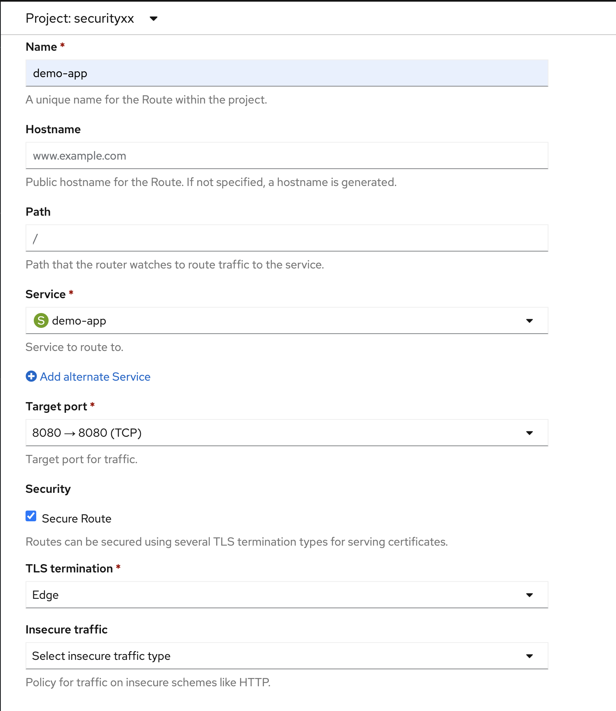

= RHSSO (aka Keycloak) Workshop

== Agenda:

Students following: 1 hour.

. [5 min] Deploy RHSSO with PostgreSQL into Openshift
. [5 min] Setup Realm, Roles and Users
. [15 min] Build frontend and backend containers using Quay.io
. [10 min] Explore Quay Security Scan
. [10 min] Deploy frontend and backend applications into Openshift
. [5 min] Register backend and frontend clients on RHSSO
. [5 min] Explore application showing authentication and authorization

== Pre-requirements

* Github Account
* Quay.io Account (Optional)
* Access to the Openshift environment, choose one user here:

 https://docs.google.com/document/d/1_SYnlRkd11gbqRhy01uCpqbvsxwVQAL-_FcdpdquF3k/edit?usp=sharing

== SSO Setup 

* Login in Openshift environment using the credential delivered on class

 https://console-openshift-console.apps.cluster-nbmmt.nbmmt.sandbox725.opentlc.com

* Click in create project on the initial page of openshift 

* Create a project named *securityXX* (Remember to replace XX to your user number.)

* Once that you are in securityXX project 
* Click Add and after on All Services Catalog

* In the Developer Catalog search for SSO and then click on SSO 7.3 (Ephemeral) to install a SSO 7.3 Ephemeral

** Click on *Instantiate Template* 
** RH-SSO Administrator Username: *admin*
** RH-SSO Administrator Password: *workshop*
** Select *Create* 

* You should see a screen similar to this:

* After service it has a dark blue border access the Red Hat Single Sign-On provisioned service,
** Click on the Open URL bottom or On Route URL

** Click on *Administration Console* 

** Fill with the credentials used before
*** user: *admin*
*** password: *workshop*

== RHSSO Realm setup

* Add a new Realm: *demo* 

* Add two roles *User* and *Admin*
** Click on *Roles* in the vertical left menu

* Add two users, first *Karina* with only *user* permission, after *Ramalho* with *user* and *admin* roles.
** Click on *Users* in the vertical left menu 
** Click on *Add user* 

*** Username: *Karina*
*** Email: karina@acme.com
*** First Name: Karina 
*** Last Name: Ramalho
*** Click on Save.

** Select *Credentials* on the horizontal sub menu. 
*** New password: *redhat*
*** Mark Temporary as *OFF*

** Select *Role Mappings* on the horizontal submenu. 
*** Select *user* on Available Roles and move to *Assign Roles*

After, register the user *Ramalho*, and on *Credentials* let the Temporary as *ON* and on *Roles* assign *admin* and *user* roles.

== Setup clients on RHSSO 

=== Demo Service Client

* On side menu, select *Clients*. Select *Add Client* and provide:
** Client ID: *demo-service*

** Root URL: *https://demo-service-security.apps.cluster-nbmmt.nbmmt.sandbox725.opentlc.com* (Adjust with your URL)

** Change Access Type to *bearer-only*

=== Demo App Client 

* Client ID: *demo-app*
* Root URL: *https://demo-app-security.apps.cluster-nbmmt.nbmmt.sandbox725.opentlc.com* (Adjust with your URL)

== Application setup

On this workshop, we will start using a prevalent scenario. 
A frontend application consuming service from an API in a backend (REST) application.

* Frontend - HTML5 application secured with Keycloak JavaScript adapter
* Backend - Node.js REST service secured with Keycloak Node.js adapter

The backend application exposes 3 services:

* Public 
* Secured (Requires user role)
* Admin  (Requires admin role)

To start, let's first fork the workshop repository to your git. 

    https://github.com/casfe03/workshop-sso

In the next steps, we will set up the application on Quay.io. It isn't mandatory since we could easily 
deploy the project using Openshift S2I mechanism, but to show a different approach, we are suggesting to use 
Quay.

Another possibility should be binary deployment, but as not everyone can build containers in your machine, 
we will explore Quay.io. Quay is responsible for forking the git repository and building the images based on a *Dockerfile*.

=== Frontend application

Demo-app  is a simple frontend application.

* Access https://quay.io 
** Create a new repository named *demo-app*

*** Select *Public* in Repository Visibility Option
*** Select *Link goes a Github Repository Push* 
**** Select your user under Organization

**** Select *workshop-sso* as your repository

**** Select *Trigger for all branches and tags* as trigger option
**** Select */demo-app/Dockerfile* as Dockerfile
**** Select */demo-app* as Context

To test if we set up everything correctly, let's trigger a build.

Edit the file demo-app/index.php changing the title to:

    <title>Your Name - Frontend App</title>

Commit and push the changes to GitHub.

After commit, go to the Quay.io panel. A build should be running.

Congrats, you have a container ready to be deployed into Openshift.

=== Backend application

Now, we will repeat the process for the backend application.

Demo-service is a NodeJS application.

* Access https://quay.io 
** Create a new repository named *demo-service*
*** Select *Public* in Repository Visibility Option
*** Select *Link go a Github Repository Push* 
**** Select your user under Organization
**** Select *workshop-sso* as your repository
**** Select *Trigger for all branches and tags* as trigger option
**** Select */demo-service/Dockerfile* as Dockerfile
**** Select */demo-service* as Context

To test if we set up everything correctly, let's trigger a build.

Edit the file demo-service/app.js changing the message on line 60 to:

    Public workshop

Commit and push the changes to GitHub.

After commit, go to the Quay.io panel. A build should be running.

Congrats, you have a container ready to be deployed into Openshift.

== Quay Security Scan

On the demo-service repository, select *Tags*. 

Click on the Scan metrics to open the Dashboard.

=== Fixing Vulnerabilities 

Open demo-service/Dockerfile, and change line 1 to:

    FROM registry.access.redhat.com/rhoar-nodejs/nodejs-10

Also, remove the WORKDIR line

    WORKDIR /usr/src/app

Commit and push those changes. 

Look the tags session again, recheck the Scan metrics, also do you notice a significant reduction on the image size?

It reinforces the quality and the compromise of Red Hat with security, and consequently, it results in stability too. 

== Deploy applications into Openshift

=== Deploying the backend application

* Under *Add* menu, select *Container images*

image::images/rhsso-deploy-app-01.png[]

* Mark *Image Name* and go to advanced options and dismark *Create a route to the Application*

    quay.io/casfe01/demo-service

* Go to Actions and edit your deployment On Environment Variables add (adapt to your values)

* In your deployment On Environment Variables add (adapt to your values)
    
    KEYCLOAK_URL=https://sso-securityXX.apps.cluster-nbmmt.nbmmt.sandbox725.opentlc.com/auth

* Go to Project section than click in route

* Create a route

** Put the name demo-service, choose the service *demo-service* and Check *Secure route* 
***

To do a quick test, access the route created with */public* in the end, you should see a json with the message attribute.

    https://demo-service-securityXX.apps.cluster-nbmmt.nbmmt.sandbox725.opentlc.com/public

=== Deploying the frontend application

You will repeat the same process to deploy the frontend application. However, in the environment variables, you must insert the SERVICE_URL too.

    SERVICE_URL=https://demo-service-securityXX.apps.cluster-nbmmt.nbmmt.sandbox725.opentlc.com

To test, you can access the route, and you will see a web application. If you click on *Invoke Public* 
you should see the message printed. 

If you click on Login, you will see an error message *"Client not found"*.

== Demo Navigation

Quick recap, there are 3 endpoints. 
- Public - No authentication/authorization is required. 
- Secured - Role *user* is required.
- Admin - Role *admin* is required. 

In the previous setup we created to users:
- *karina* with *user* role
- *ramalho* with *user*,*admin* roles

Try to invoke the Secured Endpoint, you will receive a *403 Forbidden error*

It is the expected result as you are not logged in. So Login using *karina* as username and *redhat* as password.

Now, you should be able to invoke de Secured Endpoint.

Try to invoke the Admin endpoint, you will receive a *403 Forbidden error*. So in this case you could add the permission *admin* to Karina user or log in with *ramalho* user. We will procced loggin with *ramalho* user.

Login with *ramalho* user.

Notice that as we marked to change password during the user process creation, now it is asking to update the password as expected.

Now, logged in as *ramalho* user let's try to invoke the Admin endpoint.

The request works as expected because this user as the admin permission.

Click on account and navigate through the all options from the menu on left side.

